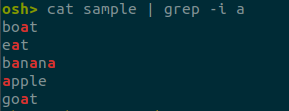

# Project 1: Simple shell - Operating System

  - [1. Setup](#1-setup)
  - [2. Features](#2-features)
  - [3. Usage](#3-usage)

## 1. Setup

1. Download this repository from github.

    ```bash
    git clone https://github.com/htn274/simple-shell.git
    cd simple-shell
    ```

2. Compile:

    ```bash
    make
    ```

3. Run:

    ```bash
    make run
    ```

## 2. Features

- Execute application with fork()
- Background command when it ends with '&'
- History feature
- Multiple direction
- Multiple pipe
- Combine pipe and direction
- Change directory
- Suggestion command
- Color for command line interface

## 3. Usage

- Run a command:

    

- Cd command:

    

- History:

    

- Redirect I/O:

    Input: ">"

    
    
    The result:

    

    Output: "<"

    

- Pipe:

    

    

    

- Suggest command by tab:

    
